# Universidad Nacional Autónoma de México Facultad de Ciencias
# Diseño e Implementación de Interfaces de Usuario Basadas en Voz
# Asistente de voz Codenow Programming
## Emmanuel Cruz Hernández

----

### Introducción
A inicios del año 2000, las aplicaciones operadas con voz comenzaron a tener mayor popularidad con el considerable crecimiento del uso de teléfonos y celulares. Conforme han pasado los años, fueron evolucionando estos dispositivos, de tal forma, que hoy en día se cuenta con múltiples funcionalidades en un único dispositivo.

Gracias a los avances en la tecnología, se ha requerido de nuevas funcionalidades para mejorar la experiencia de los usuarios y facilitar las tareas a resolver.

Una herramienta que impulsa la facilidad de comunicación es la interacción por medio de voz desde un dispositivo con los usuarios. Gracias a que la experiencia de usuario ha mejorado con herramientas basadas en voz, se han diseñado cada vez más dispositivos controlados por voz, tales como Apple HomePod, Google Home y Amazon Echo, asistentes basados en voz como Siri, Cortana o Alexa.

Estos dispositivos pueden realizar búsquedas para dar respuesta y resolver una tarea dada por un usuario, tal como responder alguna pregunta general, dar el clima, reproducir música, programar algún evento, entre muchos otros. En la figura siguiente se muestran los porcentajes de las peticiones de las los dispositivos basados en voz por parte de los usuario, según la _ComScore_ (Comscore es una compañía de investigación de marketing en Internet que proporciona datos de marketing y servicios para muchas de las mayores empresas de Internet).

Todas las peticiones mostradas, por lo general, requieren de una petición o una pregunta para activarse y poder funcionar, lo cual hace muy sencillo el funcionamiento de comunicación entre el dispositivo y el usuario, además de ser rápido al realizar una tarea. Sin embargo, un dispositivo basado en voz puede activarse sin necesidad de hacer una petición, por ejemplo, cuando se notifica una alarma o un recordatorio, lo cual mejora la experiencia de usuario al no estar al pendiente de una notificación visual o depender de la desactivación física de un dispositivo.

Esta última funcionalidad hacia los usuarios, abre la puerta a que el uso de dispositivos basados en voz aumente considerablemente y tenga mayor popularidad hoy en día. Por ejemplo, un usuario que está conduciendo un automóvil, podría realizar llamadas, tener control completo sobre la música en reproducción, saber la hora, conocer la dirección de un destino, escuchar postcats e incluso practicar un idioma o aprender recetas de cocina, todo, sin necesidad de tocar la pantalla de un dispositivo, lo cual provee al usuario, además de facilidad, seguridad a un usuario para no fijar la mirada en distractores como lo es una pantalla.

De este ejemplo, se puede observar la gran ventaja de adaptar un dispositivo basado en voz mientras un usuario conduce, sin embargo, hay más ventajas de usar este tipo de interfaces:
* Velocidad
Incluso para los expertos en mensajes de texto, la facultad de hablar hace más rápido el proceso de comunicación. Básicamente se puede afirmar que _hablar es más rápido que escribir_ para solicitar alguna petición. Esta afirmación está demostrada por un estudio de _Stanford_ (El estudio donde de la demostración es Shahani, A. (2016). _Voice Recognition Software Finally Beats Humans At Typing, Study Finds._).
* Manos libres
Tal como se mencionó en el ejemplo del conductor, realizar acciones como conducir o cocinar hace que hablar sea más práctico hablar que escribir, además de proveer mayor seguridad.
* Intuitividad
Hablar es una habilidad muy bien desarrollado por la mayoría de la población, por lo que es muy intuitivo el manejo de una interfaz usando la voz como medio de comunicación.
* Empatía
La entonación de una frase dice mucho en cómo se comunica un mensaje. Es decir, no es lo mismo decir _"estoy feliz"_ en un tono alegre, emocionante y un tanto exaltado, a diferencia de decir exactamente la misma frase en un tono indiferente, triste y sin ánimo. La comunicación con un dispositivo basado en voz puede proveer más información que la que puede dar un dispositivo en texto o en imágenes.

A pesar de las ventajas que pueden surgir con una interfaz basada en voz, es importante mencionar que no siempre es buena idea aplicarlas. A continuación se muestran algunos casos:
* Espacios públicos
Es importante mantener privada cierta información, ya sea dada por el usuario o dada como respuesta desde el dispositivo. Si la información que está en juego entre la comunicación es de caracter privado o que los usuarios podrían considerar como privado o íntimo, podría no ser buena idea usar una interfaz basada en voz, donde la información puede ser recibida por un tercero.
* Incomodidad al hablar con una computadora
A pesar de la facilidad de comunicación por voz, existen personas que no sienten comodidad al hablar con una computadora. Se vuelve un poco vergonzoso hablar _"a la nada"_. Si alguna aplicación está dirigida a usuarios que en su mayoría tienen esta dificultad, no es buena idea incluir el manejo por voz.
* Usuarios que prefieren texto
Cierto porcentaje de los usuarios prefieren usar un dispositivo por medio de texto porque sienten mayor facilidad del manejo en la interfaz.
* Proteger la privacidad
Relacionado un poco a la limitante de usar interfaces basadas en voz en lugares públicos, es importante proteger la privacidad de los usuarios. Esto es, no dar más información de la necesaria o información valiosa. Por ejemplo, si se quiere comprar algún producto por medio de voz, no se puede proporcionar el número de tarjeta ni claves por voz, ya que esto hace inseguro el sistema, ya que un tercero puede escuchar todos estos datos. No sólo por parte del usuario, sino también del sistema, por ejemplo, si este pide confirmación del número de cuenta repitiendo el número.

Dicho lo anterior, las interfaces basadas en voz amplia la posibilidad de facilitar una tarea y esta es la mayor razón por la que se han vuelto populares.

----

### Definición del problema
Un blog es un sitio web que comparte contenido de interés del autor, por lo que hay gran variedad de temas que se encuentran abordados en la web por blogs. Se pueden encontrar blogs donde se habla de música, de coches, de cocina, de tecnología, de medicina, de deportes, de naturaleza, de gatos e infinidad de temas donde la programación no se queda atrás. 

Al ser un blog una herramienta con gran cantidad de contenido e información, el manejo y la búsqueda de temas específicos puede llegar a ser difícil entre tantas entradas, lo cual es un problema muy grande para brindar buena experiencia a los usuarios, ya que la búsqueda puede causar desesperación, intriga e incluso pérdida de interés por conocer el tema al no tener un sistema cómodo y rápido de búsqueda.

En el presente proyecto, se tiene como objetivo facilitar la búsqueda de información dentro de un blog específico llamado _Codenow Programming_, así como tener buen manejo sobre el mismo, de tal forma que el usuario tenga buena experiencia al aprender conceptos básicos del lenguaje de programación _Java_ (Java es una tecnología que se usa para el desarrollo de aplicaciones que convierten a la Web en un elemento más interesante y útil. Java no es lo mismo que javascript, que se trata de una tecnología sencilla que se usa para crear páginas web y solamente se ejecuta en el explorador).

La posibilidad de sincronizar la información del blog _Codenow Programming_ a un asistente de voz será gracias al asistente de voz _Alexa_ (Alexa es el servicio de voz ubicado en la nube de Amazon disponible en los dispositivos de Amazon y dispositivos tercios con Alexa integrada) desarrollado por la compañía _Amazon_.

La forma en que el blog se desarrolla es por medio de una _skill_ de _Alexa_ y está dirigido para usuarios que quieren comenzar a aprender programación, así como programadores que quieren repasar sus conocimientos en un lenguaje orientado a objetos, teniendo como base _Java_ para llevar de la mano al usuario con ejemplos y definiciones.

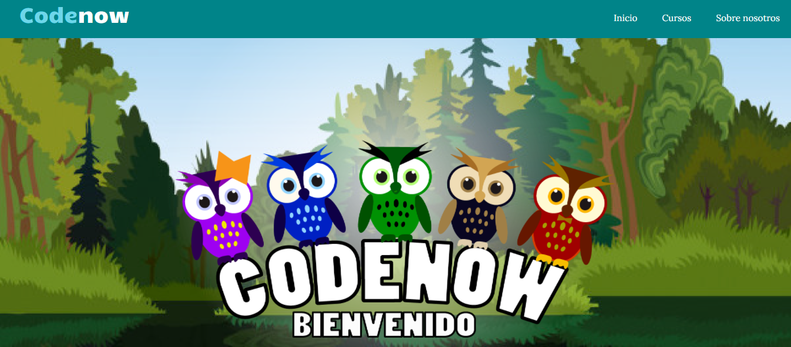

----

### Justificación
A pesar de existir gran variedad de plataformas que permiten tener organización de un blog, ninguna cuenta con un sistema que permita interactuar con los usuarios por medio de voz para mejorar búsquedas y realizar peticiones de información de una forma más rápida.

Los blogs que disponen de sistemas basados en voz y proporcionan facilidades al usuario, son la minoría comparado con la gran cantidad de blogs y contenido de forma escrita en la web. A pesar del buen desarrollo sobre las interfaces basadas en voz, la actualización de ciertas utilidades, como el manejo de un blog,se ha quedado atrás con la posibilidad de extender los contenidos a un manejo por medio de voz y tener mayor impacto en las nuevas tecnologías.

La skill sobre _Alexa_ que proporciona el asistente de voz para el blog _Codenow Programming_ aporta a los usuarios la posibilidad de manejar y aprender el contenido de un blog de forma más directa y personalizada por medio de un _asesor virtual_. Además de ser relevante para el desarrollo e impulso para extender el contenido de las plataformas que aportan administración de blogs a un asistente basado en voz por medio de skills con apoyo de los dispositivos que se pueden sincronizar con _Alexa_.

Para este primer avance de la skill, se podrán aprender conceptos básicos de los lenguajes de programación orientados a objetos. Esta skill se puede extender en un futuro para guiar en el conocimiento de distintas áreas como inteligencia artificial, estructuras de datos, bases de datos, computación concurrente, y lenguajes de programación, tal como Python, Ruby, Haskell, C o C++. Con esta propuesta se tiene como objetivo aportar más contenido y variedad a los usuarios basados en las actualizaciones del blog [Codenow Programming](https://codenowprogramming.000webhostapp.com/).

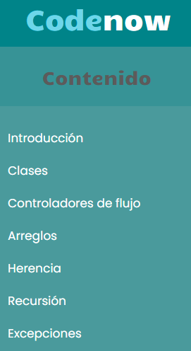

Esta skill está dirigida a usuarios que gustan de conocer nuevas tecnologías principalmente a usuarios que gustan de conocer de nuevas tecnologías y sacarles el mayor provecho posible. En este caso, del manejo de un blog por medio de un sistema pregunta-respuesta, para sentir que un asesor virtual acompaña durante el proceso de aprendizaje del contenido del blog de forma auditiva y visual para dispositivos que lo permiten.

----

## Diseño de la solución

### Sobre el usuario
El desarrollo de la skill que hace posible el asistente virtual por medio de voz para el blog _Codenow Programming_ se basa en teoría relacionada a la experiencia de los usuarios. La skill está pensada para usuarios interesados en las aplicaciones de la nueva tecnología para sacarles el mejor provecho posible para realizar tareas de forma sencilla, así como usuarios interesados en la programación. El usuario central, al estar inmerso en la tecnología, cuenta con un 95% de conocimiento sobre el manejo de distintos dispositivos, tal como celulares, iPods, tablets, computadoras, asistentes de voz, entre otros. Dado que estos usuarios están muy interesados en la tecnología desarrollada, son muy curiosos por conocer nuevas herramientas y saber sobre distintos temas. El usuario general del cuál se basa el modelo de la skill se muestra en la [figura siguiente](https://github.com/EmmanuelCruz/Codenow_por_Voz/blob/master/Documentos/Sobre%20los%20usuarios.pdf):

### Experiencia de usuario enfocada al asistente de voz Codenow
Dado que la skill impulsa la iniciativa de enseñar programación de una forma cómoda, se toman bases de estudios realizados para mejorar la experiencia de usuario. Además, se toma la experiencia de 40 personas a quienes se le mostró el funcionamiento de la skill, así como los resultados de una encuesta aplicada a 36 personas sobre las necesidades y opinión de las interfaces basadas en voz.

Estos resultados recaudados dan base a los siguientes puntos que mejoran el funcionamiento de la skill:
* Inmersión
Este punto pretende que el usuario se sienta inmerso en el ambiente de interacción entre el dispositivo. La inmersión en la skill busca que el usuario se sienta motivado a utilizarla y no se haga aburrida la interacción, de tal forma que se sienta con la curiosidad de saber más información y avanzar con el asistente virtual en los temas.
Los usuario a quienes se les mostró la interacción de la skill se mostraron atentos, interesados y con ganas de seguir preguntando conceptos y descubrir las diferentes funcionalidades con las solicitudes realizadas. La idea pareció muy interesante e innovadora. De hecho, el 100% de las personas encuestadas respondió que no conoce algún blog que pueda ser manejado por voz. Este fue un punto muy importante para lograr la inmersión de la skill con los usuarios que probaron las funcionalidades.

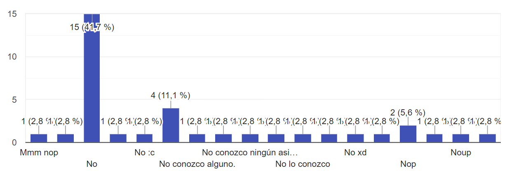

* Logro de metas
Además de atraer la atención del usuario, es importante que también sienta satisfacción de llevarse una buena impresión y sentir que el conocimiento sobre los conceptos básicos de programación se entienden de forma clara y se relacionan entre ellos para avanzar en todos los temas incluidos en la skill.
Uno de los mayores problemas que presentaron los blogs sobre la Web es el tiempo que toma encontrar la información que un usuario requiere. A continuación, se muestra una gráfica del promedio que toma encontrar información.

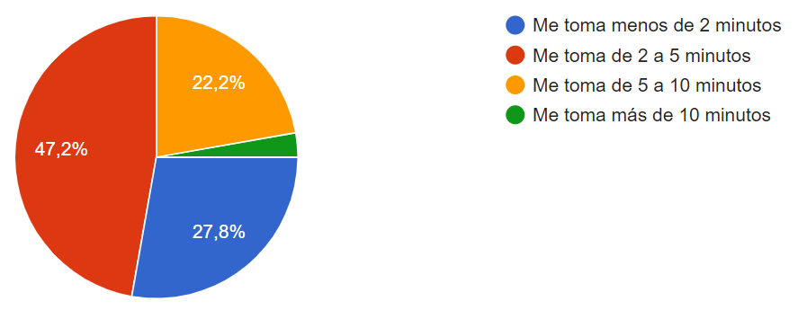

El 47.2% de 36 encuestados tarda de 2 a 5 minutos en encontrar la información que busca en un blog sobre la Web.

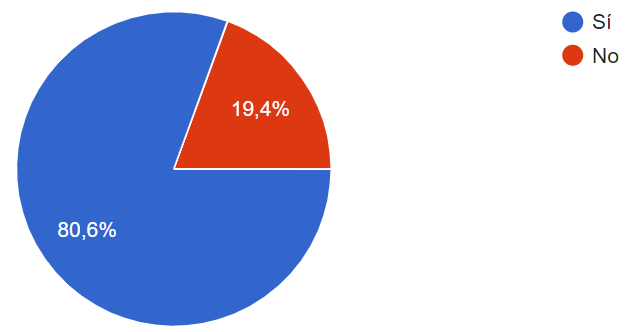

De los 36 encuestados, el 80.6% opina que la rapidez con la que se encuentra la información en un blog por medio de voz mejoraría considerablemente. Enfocado a las pruebas hechas sobre la skill con los 40 usuarios que manejaron las funcionalidades, se obtuvieron los siguientes resultados sobre el tiempo de respuesta en las solicitudes:
	* Encontrar la información en el blog de la Web, tardó un promedio de 1 minuto 30 segundos.
	* Encontrar la misma información con la skill, tardó un tiempo promedio de 10 segundos.

Usar la skill efectivamente mejoró el tiempo de búsqueda, por lo que los usuarios de prueba quedaron más satisfechos con la búsqueda por voz. Se logró como meta obtener información de forma más rápida, más entretenida y más clara.

A partir de los puntos mostrados, se desarrolló un mapa que lleva de la mano al usuario desde un objetivo hasta una meta al utilizar la skill. Este mapa se muestra en la siguiente [figura](https://github.com/EmmanuelCruz/Codenow_por_Voz/blob/master/Documentos/Customer%20Journey%20Map.pdf):

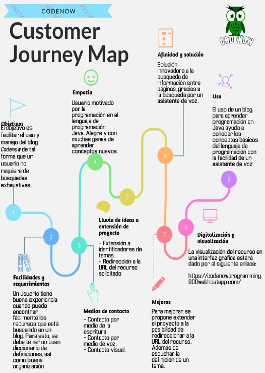

Finalmente, para un mejor diseño sobre el manejo del asistente, se consideraron puntos importantes que están directamente a criterios ergonómicos para transmitir información de la mejor manera posible y el usuario se sienta más cómodo.

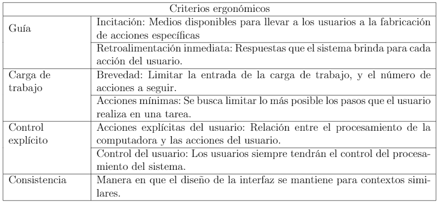

### Funcionamiento de la Skill
Finalmente, para que el usuario pueda tener comunicación con el asistente de blog por medio de un dispositivo, el flujo de conversación se basa en peticiones y respuestas, de tal forma que hay interacción con la aplicación con el flujo mostrado en la siguiente figura:

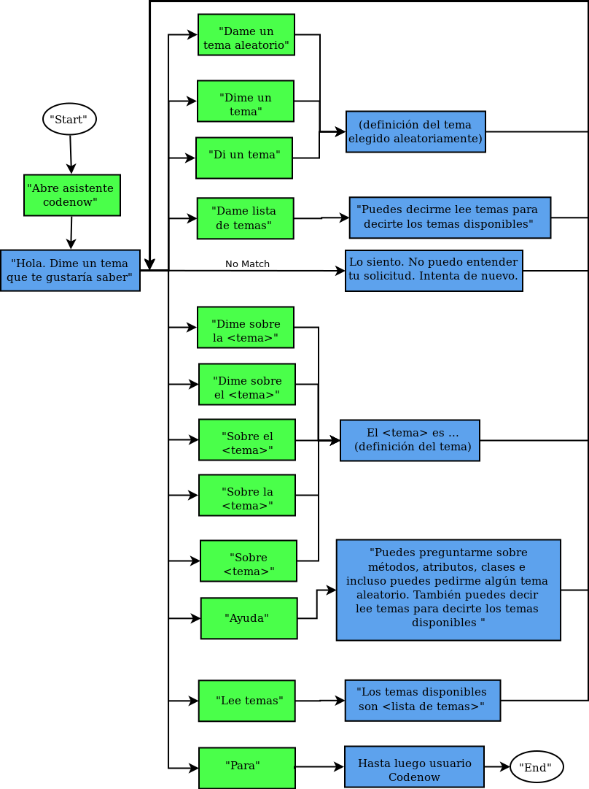

Para navegar en el flujo de conversación, se consideran distintos casos con los que el usuario puede activar la skill para realizar peticiones, recibir respuestas, entrar a la skill, realizar otra pregunta y terminar con la ejecución de la skill.

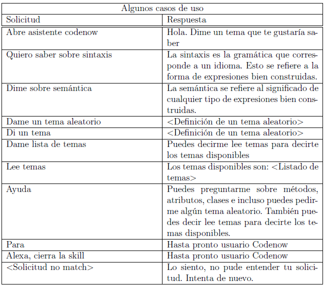

La skill cuenta con más de 65 casos de uso. Más casos de uso considerados para la skill se muestran en el siguiente enlace: [https://github.com/EmmanuelCruz/Codenow_por_Voz/blob/master/Documentos/Casos%20de%20uso.pdf](https://github.com/EmmanuelCruz/Codenow_por_Voz/blob/master/Documentos/Casos%20de%20uso.pdf).

A continuación se muestra una ejecución donde interviene el usuario directamente con la skill para su manejo.
* Inicio de la skill. Es la invocación principal para activar el ambiente del asistente virtual de manejo del blog.

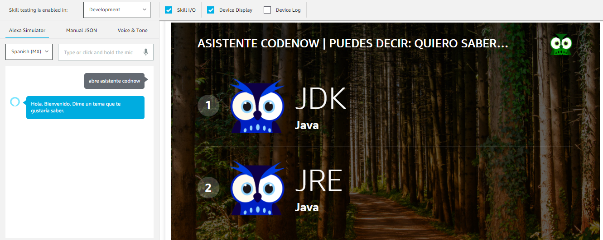

* Para solicitar información de un tema del blog, se utiliza alguna frase de petición como _"Dime sobre ..."_, _"Quiero saber sobre ..."_, entre otros.

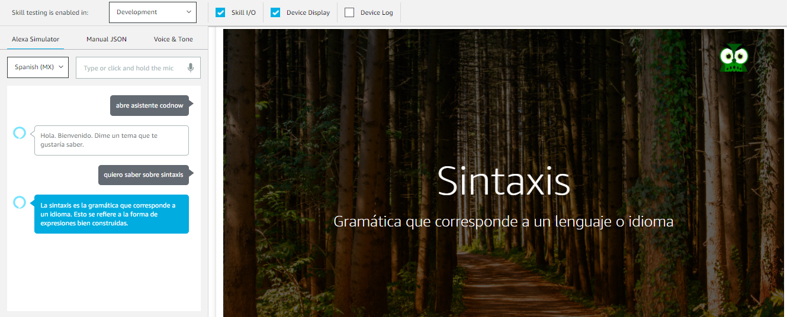

* La skill también permite solicitudes de algún tema aleatorio, con el fin de que pueda servir a forma de repaso con el apoyo de frases como _"Dame un tema aleatorio ..."_, _"Dame un tema ..."_, entre otros.

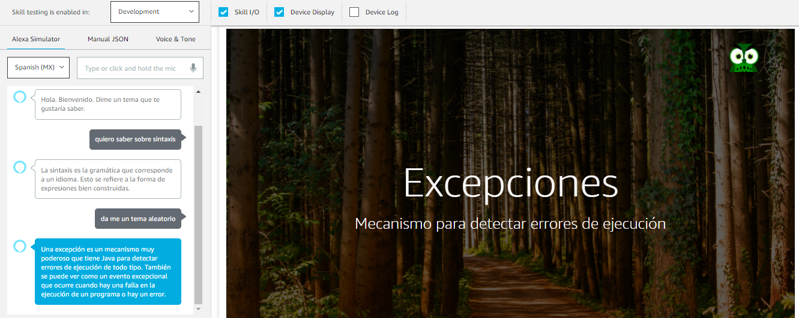

* La posibilidad de guía en dispositivos con interfaz gráfica permite regresar al menú de contenido. Para dispositivos que no cuentan con interfaz gráfica, se da la posibilidad de conocer el contenido con la lectura de temas disponibles.

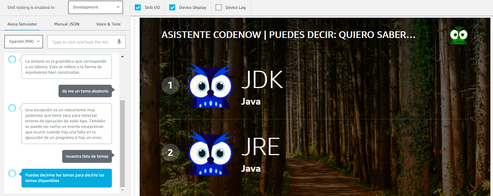

* El apoyo a los usuarios da la guía y sistema de solitud de información en la skill. Se aconsejan algunos temas, se da a conocer la obtención de temas aleatorios y la lectura de temas.

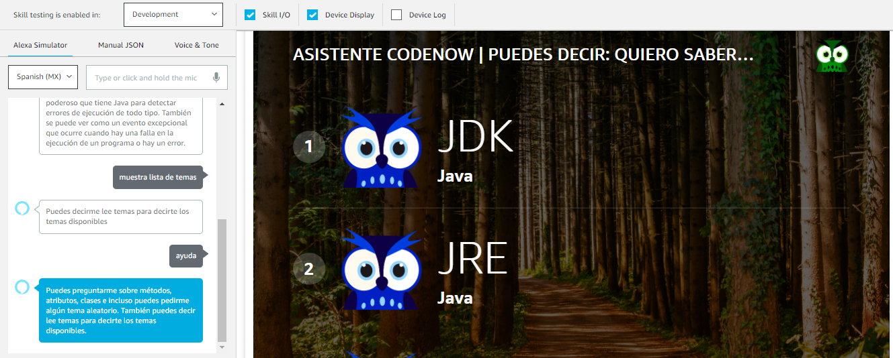

* Cuando una solicitud no está definida, se informa que la solicitud no está definida en la skill. Podría suceder por temas que no están en el banco de temas.

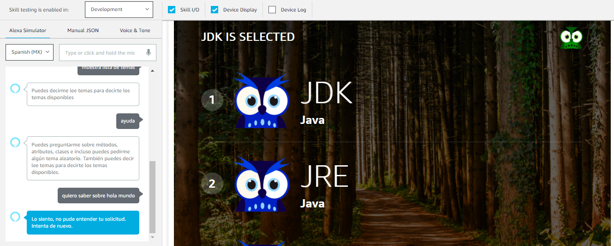

* El cierre de la skill muestra una despedida en interfaz gráfica, así como despedida auditiva.

Para ver el funcionamiento de la skill de forma interactiva, se puede consultar el siguiente vídeo: [https://youtu.be/7UXN7wkaSM4](https://youtu.be/7UXN7wkaSM4).

----

### Conclusiones
Para probar el buen funcionamiento de la skill se consideraron los puntos referentes a una buena experiencia de usuario. Se hicieron experimentos con usuarios con conocimientos en programación y con usuarios con conocimientos básicos de las definiciones.

Aquellos usuarios que no cuentan con conocimientos en programación, fueron capaces de trabajar con skill con ciertas complicaciones porque no sabían qué conceptos preguntar, sin embargo, se sintieron muy cómodos y motivados por preguntar más definiciones, así como aprender más contenido del blog. El experimento consitió en presentar el blog y leer el contenido hasta encontrar definiciones con las que los usuarios no se encontraban familiarizados y preguntar a la skill a modo de banco de definiciones.

Aquellos usuarios que cuentan con conocimientos básicos de programación la skill tuvieron mejor adaptación con la skill sin necesidad de conocer el blog de forma visual, ya que hacían peticiones de definiciones muy concretas como controladores de flujo, variables, operadores, herencia, polimorfismo, entre otros.

* **Ventajas**
	* La búsqueda de información se hace de forma muy rápida.
	* La interacción entre el usuario y el dispositivo se vuelve un tanto simpática al interpretar los tonos del dispositivo al transmitir información.
	* Se vuelve más fácil escuchar en contenido de un blog en lugar de leerlo.
	* La información dada como respuesta es corta y concreta, lo cual facilita el recordar conceptos cortos.
	* Los usuarios que experimentaron con la skill se sintieron motivados por utilizarla, ya que no es común tener un blog basado en voz.
	* El flujo de conversación con el dispositivo es más directo a comparación de buscar información directamente del blog, ya que se comienza desde la vista inicio, la vista de contenido, el acceso a los temas, el acceso a los subtemas y encontrar el contenido en la entrada del blog.
* **Desventajas**
	* La skill no cuenta con un comando de apoyo para recomendar temas disponibles del blog, por lo que los usuarios que no tienen conocimientos en programación se pueden perder fácilmente.
	* Dado que la skill se basa en voz, es difícil mostrar ejemplo de código por dos razones: dictar código por medio de voz se vuelve difícil de digerir; la pantalla de algunos dispositivos tiene el espacio muy limitado para mostrar un ejemplo de código.
	* El banco de información de esta primera versión de la skill está limitado a 54 definiciones, lo cual hace poco completo el contenido a comparación del contenido del blog.
	* La skill sobre la plataforma de la empresa _Amazon_, por lo que la obtención de esta herramienta sólo es posible con uno de los dispositivos que cuentan con reconocimiento de voz.

Analizando las fallas de la skill dadas en las desventajas, se podría mejorar el comportamiento considerando al extender el banco de conceptos y temas conforme avance el desarrollo y el contenido del blog. Otras propuestas de mejora dadas por algunos usuarios se muestran a continuación:

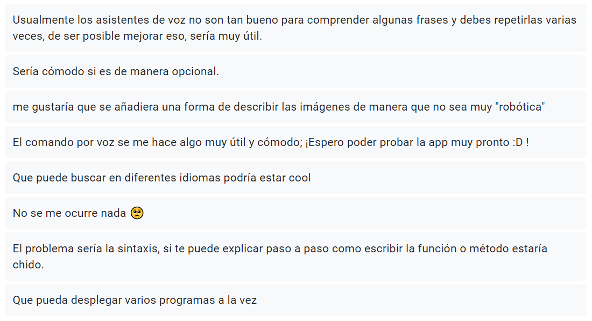

----
## Bibliografía y referencias
* [1] Wikipedia, _comScore_, 28 de marzo de 2020, Recuperado de [https://es.wikipedia.org/wiki/ComScore](https://es.wikipedia.org/wiki/ComScore).
* [2] Cathy Pearl, _Designing Voice User Interfaces_, O.REILLY, United States of America, 2017.
* [3] Frederik Goossens, _Designing a VUI — Voice User Interface_, 14 de mayo de 2018, Recuperado de [https://medium.com/voice-experience-design/designing-a-vui-voice-user-interface-c0b3b9b57ace](https://medium.com/voice-experience-design/designing-a-vui-voice-user-interface-c0b3b9b57ace)
* [4] Real Academia Española, _Blog_, Enero de 2021, Recuperado de [https://dle.rae.es/blog](https://dle.rae.es/blog)
* [5] Oracle, _¿Qué es Java?_, 2020, Recuperado de [https://www.java.com/es/about/whatis_java.jsp](https://www.java.com/es/about/whatis_java.jsp)
* [6] Amazon Developer, _¿Por qué Alexa?_, Enero de 2021, [https://developer.amazon.com/es-ES/alexa](https://developer.amazon.com/es-ES/alexa)
* [7] Mendoza, M. (2001). _Metodología para el desarrollo de software educativo multimedia_. Tesis.UNAM. pp. 82-93, 97, 175-183.
* [8] Jonathan Anderson, John McRee, Robb Wilson. _Effective UI: The Art of Building Great User Experience in Software_. "O" Reilly Media, 2010.